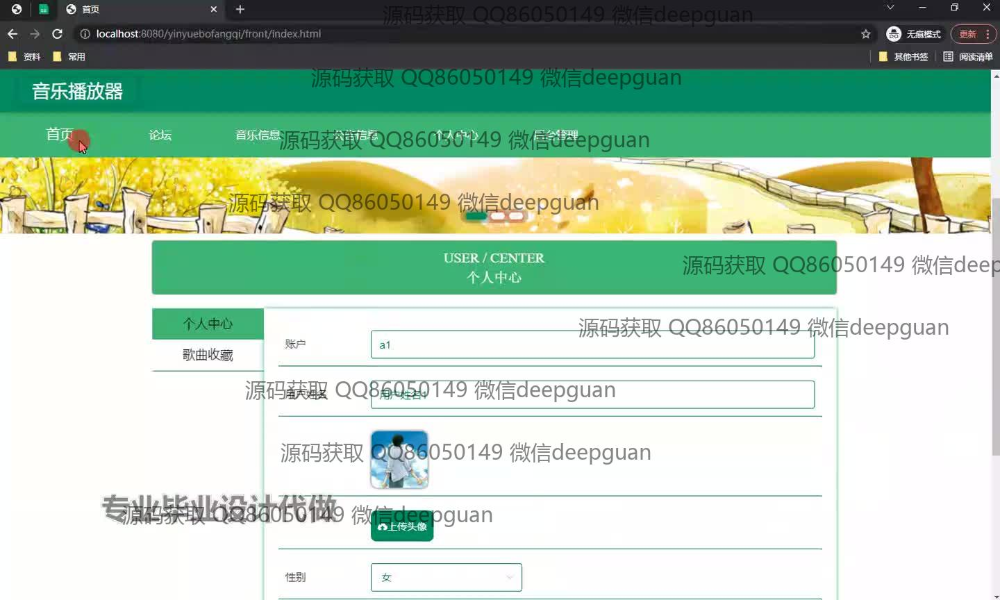
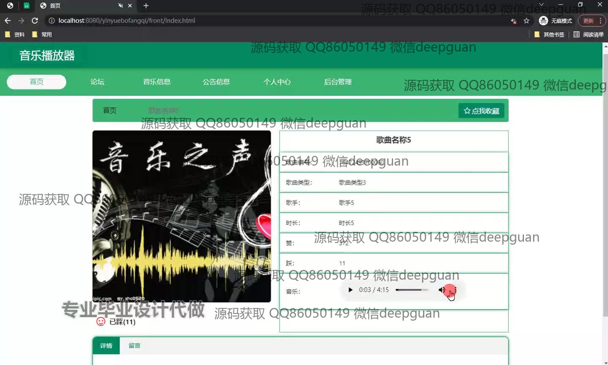
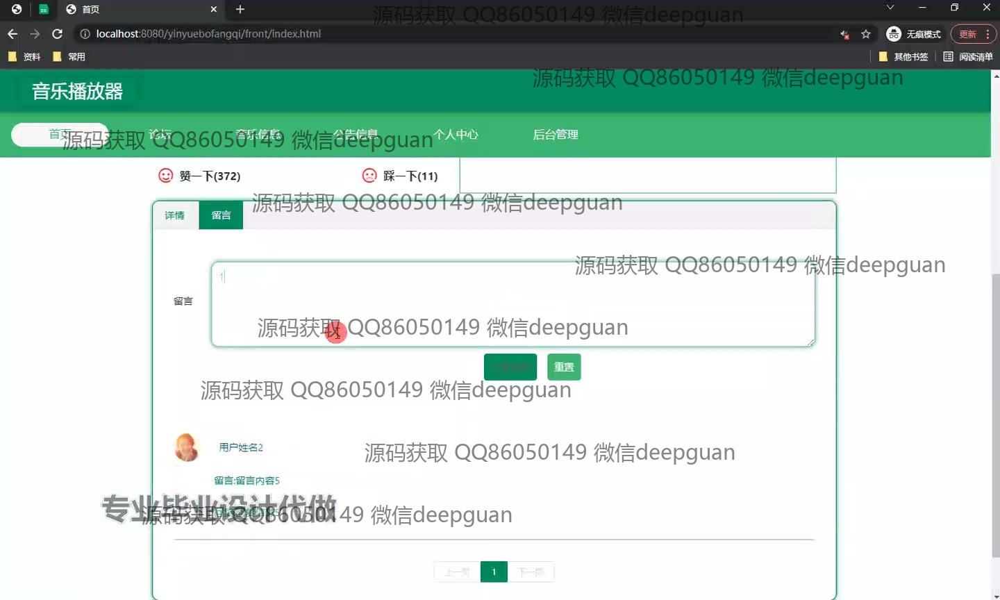
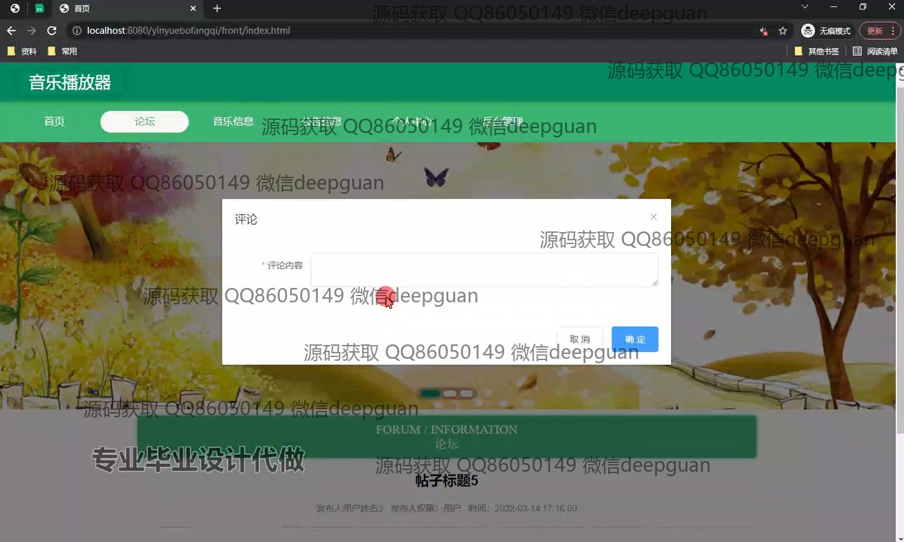
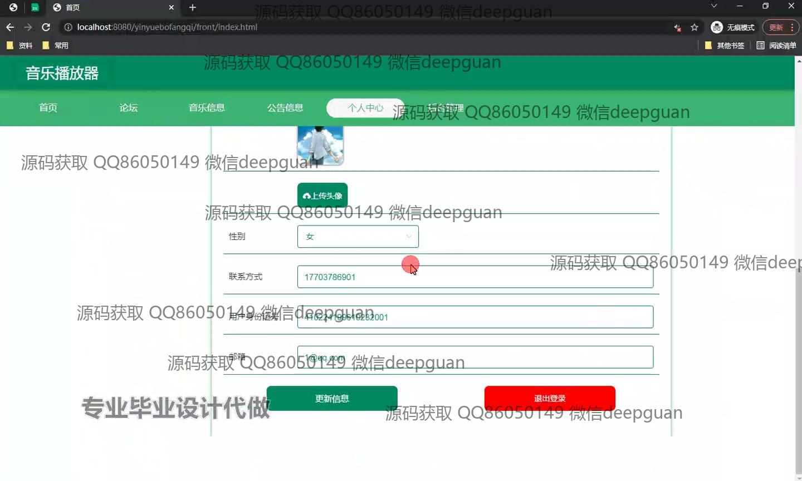
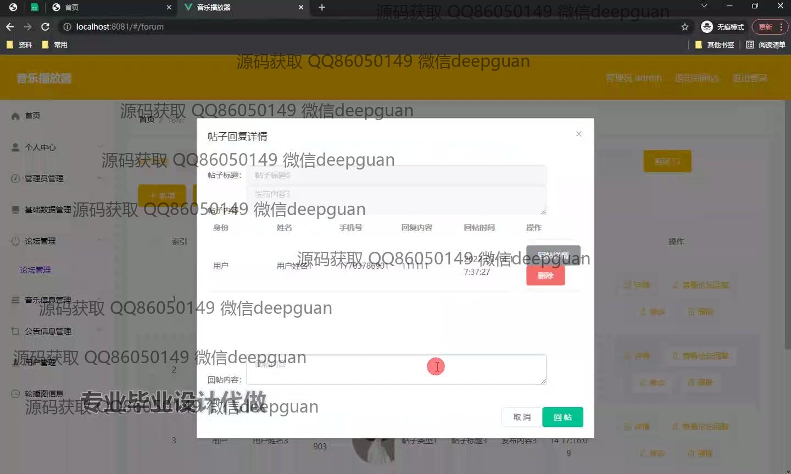
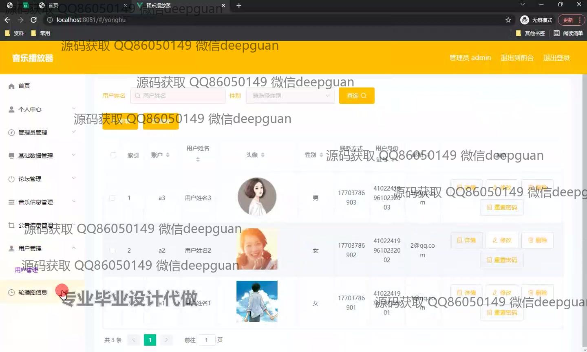
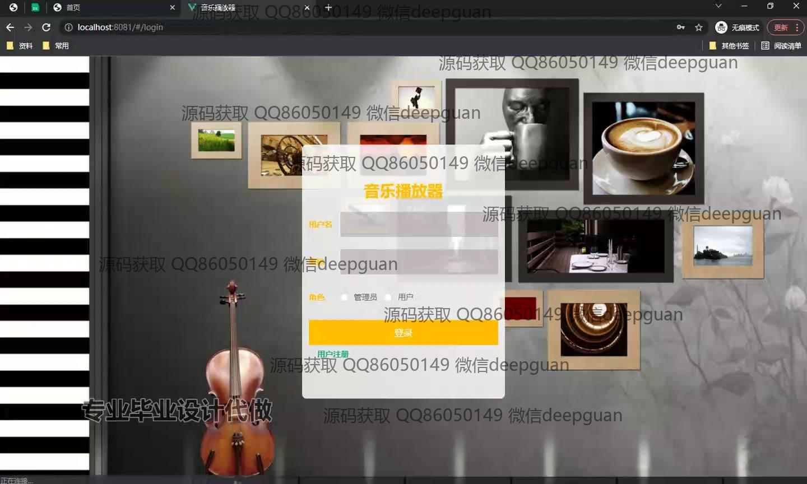

<h1 align="center">基于vue的音乐播放器的设计与实现+vue</h1>

## 简介
音乐播放器系统：角色分为管理员、用户；功能包括论坛管理、用户信息管理、音乐播放与管理、评论与反馈、用户注册登录支持多项基础管理操作。    --计算机毕业设计源码；毕设源码；java毕业设计源码

## 联系方式

<h3 align="center">获取完整代码与数据库文件 + 微信：deepguan QQ: 86050149 QQ群: 783742310</h3>

<h3 align="center">可帮忙远程部署 包运行成功！提供远程部署、修改代码、设计文档指导、代码讲解等服务！</h3>

## 功能介绍（完整见运行截图）
管理员：基本功能包括登录、注册和退出。用户管理界面能查看和编辑用户的详细信息如头像、性别、联系方式、身份证号和邮箱，并提供编辑、删除、重置密码等功能。论坛管理功能涵盖帖子回复查看与管理，包括回复详情与删除操作。后台管理模块提供对用户信息的高效管理与处理。

用户：基本功能包括登录、注册和退出。用户界面提供个人信息编辑与管理功能，如账户、姓名、性别编辑及头像上传。音乐界面展示歌曲详细信息，包括编号、类型、歌手、时长和热度，并支持播放、暂停及音量调节。个人中心支持个人资料更新与退出登录。论坛部分支持用户留言与互动，提供评论、点赞及踩的功能。

## 运行截图

本代码来源于网络,仅供学习参考使用!

